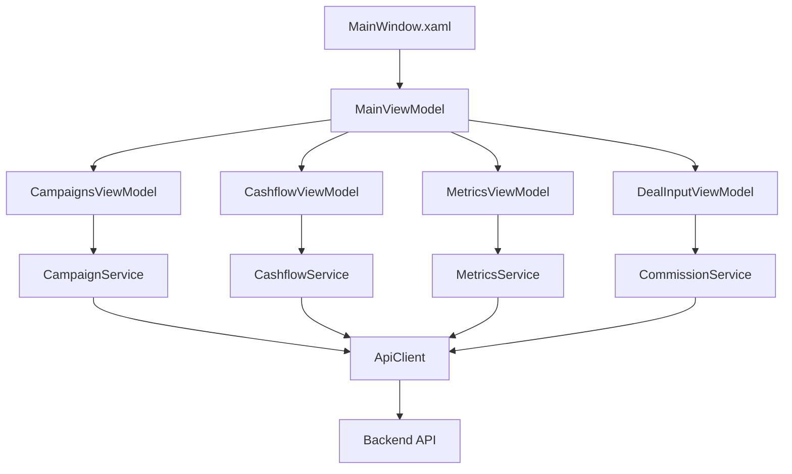

# Financial Calculator WinUI3 Refactoring Plan

## Executive Summary

This document outlines a comprehensive refactoring strategy to split the oversized `MainViewModel.cs` (1149 lines) and `MainWindow.xaml` (625 lines) into smaller, more manageable components following the 500-line rule and SOLID principles. The refactoring will improve maintainability, testability, and scalability while preserving all existing functionality.

## Current State Analysis

### File Size Violations
- **MainViewModel.cs**: 1149 lines (129% over limit) - Must be split into at least 3 files
- **MainWindow.xaml**: 625 lines (25% over limit) - Must be split into at least 2 files

### Identified Functional Groupings

#### MainViewModel.cs Components
1. **Deal Input Management** (Lines 23-193): ~170 lines
   - Deal parameters (product, price, down payment, balloon, term)
   - Rate mode management (fixed rate vs target installment)
   - Unit conversions (THB vs %)
   - Lock modes and validation

2. **Campaign Management** (Lines 78-247): ~169 lines
   - Standard campaigns collection and selection
   - My Campaigns collection and CRUD operations
   - Campaign persistence (save/load)
   - Copy operations between collections

3. **Subsidy & IDC Management** (Lines 45-62, 159-177, 976-1011): ~87 lines
   - Subsidy budget tracking
   - Dealer commission calculations
   - IDC other management
   - Commission policy fetching

4. **Cashflow Management** (Lines 87-96, 782-974): ~200 lines
   - Cashflow grid population
   - Cumulative calculations
   - Period-by-period breakdown
   - Export functionality

5. **Metrics & Profitability** (Lines 100-102, 640-780): ~142 lines
   - Key metrics calculations
   - RoRAC waterfall components
   - Profitability details refresh
   - Formatted text properties

6. **API Integration & Data Loading** (Lines 249-639): ~390 lines
   - Campaign summaries loading
   - Calculation requests
   - Parameter set management
   - Backend communication

#### MainWindow.xaml Components
1. **Deal Input Section** (Lines 33-202): ~169 lines
2. **Campaign Grids** (Lines 204-307): ~103 lines
3. **Bottom Metrics Summary** (Lines 309-513): ~204 lines
4. **Cashflow Tab** (Lines 532-622): ~90 lines
5. **Root Structure & Footer** (Lines 1-32, 514-625): ~59 lines

## Proposed Architecture

### ViewModels Structure

```
ViewModels/
├── MainViewModel.cs (~350 lines) - Orchestrator
├── DealInputViewModel.cs (~300 lines)
├── CampaignsViewModel.cs (~400 lines)
├── CashflowViewModel.cs (~350 lines)
├── MetricsViewModel.cs (~250 lines)
├── CampaignSummaryViewModel.cs (existing, ~50 lines)
└── CashflowRowViewModel.cs (~30 lines)
```

### Views Structure

```
Views/
├── MainWindow.xaml (~200 lines) - Container
├── UserControls/
│   ├── DealInputUserControl.xaml (~200 lines)
│   ├── CampaignsUserControl.xaml (~180 lines)
│   ├── CashflowUserControl.xaml (~150 lines)
│   └── MetricsSummaryUserControl.xaml (~250 lines)
```

### Services Structure

```
Services/
├── Interfaces/
│   ├── ICampaignService.cs
│   ├── ICashflowService.cs
│   ├── IMetricsService.cs
│   └── IExportService.cs
├── CampaignService.cs (~200 lines)
├── CashflowService.cs (~150 lines)
├── MetricsService.cs (~150 lines)
├── ExportService.cs (~100 lines)
├── ApiClient.cs (existing)
├── BackendLauncher.cs (existing)
├── DebounceDispatcher.cs (existing)
└── Logger.cs (existing)
```

## Detailed Class Responsibilities

### 1. MainViewModel (Orchestrator)
**Responsibility**: Coordinate child ViewModels and handle cross-cutting concerns

**Properties**:
- `DealInputViewModel DealInput`
- `CampaignsViewModel Campaigns`
- `CashflowViewModel Cashflow`
- `MetricsViewModel Metrics`
- `string Status`

**Methods**:
- `InitializeAsync()` - Initialize all child ViewModels
- `RecalculateAsync()` - Coordinate recalculation across ViewModels
- Event handlers for child ViewModel property changes

**Dependencies**:
- All child ViewModels
- `IApiClient`

---

### 2. DealInputViewModel
**Responsibility**: Manage all deal input parameters and validation

**Properties**:
- Product selection (HP, mySTAR, FL, OL)
- Price and payment parameters
- Down payment (amount/percent with unit toggle)
- Balloon payment (amount/percent with unit toggle)
- Term and timing
- Rate mode (fixed/target installment)
- Subsidy budget
- IDC commission management

**Methods**:
- `ValidateDealInputs()` - Validate all inputs
- `BuildDealDto()` - Convert to DTO for API calls
- `UpdateCommissionMode()` - Handle commission mode changes
- `ConvertUnits()` - Handle THB/% conversions

**Events**:
- `DealInputChanged` - Notify when any input changes

**Dependencies**:
- `ICommissionService`
- `IValidationService`

---

### 3. CampaignsViewModel
**Responsibility**: Manage standard and custom campaigns

**Properties**:
- `ObservableCollection<CampaignSummaryViewModel> StandardCampaigns`
- `ObservableCollection<CampaignSummaryViewModel> MyCampaigns`
- `CampaignSummaryViewModel SelectedCampaign`
- `CampaignSummaryViewModel SelectedMyCampaign`
- `CampaignSummaryViewModel ActiveCampaign`

**Commands**:
- `CopyToMyCampaignsCommand`
- `NewBankCampaignCommand`
- `SaveAllCampaignsCommand`
- `LoadCampaignsCommand`
- `ClearCampaignsCommand`

**Methods**:
- `LoadStandardCampaignsAsync()`
- `RefreshCampaignSummariesAsync()`
- `PersistMyCampaigns()`

**Events**:
- `ActiveCampaignChanged` - When selection changes

**Dependencies**:
- `ICampaignService`
- `IFileService`

---

### 4. CashflowViewModel
**Responsibility**: Manage cashflow calculations and display

**Properties**:
- `ObservableCollection<CashflowRowViewModel> Cashflows`
- `string CampaignName`
- `string TotalPrincipalPaid`
- `string TotalInterestPaid`
- `string TotalFeesPaid`
- `string NetAmountFinanced`

**Methods**:
- `PopulateCashflows(schedule)`
- `CalculateCumulatives()`
- `GenerateBreakdowns()`

**Commands**:
- `ViewCashflowsCommand`
- `ExportCashflowCommand`

**Dependencies**:
- `ICashflowService`
- `IExportService`

---

### 5. MetricsViewModel (Enhanced)
**Responsibility**: Calculate and display key metrics and profitability

**Properties**:
- Basic metrics (Monthly, Nominal, Effective, Financed, RoRAC)
- Waterfall components (IRR, margins, costs)
- Separated IDC/Subsidy percentages
- Formatted text properties

**Methods**:
- `RefreshMetrics(calculationResponse)`
- `CalculateProfitability()`
- `UpdateWaterfallComponents()`

**Dependencies**:
- `IMetricsService`

---

### 6. Service Interfaces

#### ICampaignService
```csharp
public interface ICampaignService
{
    Task<List<CampaignDto>> GetCatalogAsync();
    Task<List<CampaignSummaryDto>> GetSummariesAsync(DealDto deal, DealStateDto state);
    Task SaveMyCampaignsAsync(List<CampaignSummaryViewModel> campaigns);
    Task<List<CampaignSummaryViewModel>> LoadMyCampaignsAsync();
}
```

#### ICashflowService
```csharp
public interface ICashflowService
{
    Task<CashflowSchedule> CalculateCashflowAsync(DealDto deal, CampaignDto campaign);
    CashflowSummary CalculateSummary(CashflowSchedule schedule);
    List<CashflowRowViewModel> GenerateRows(CashflowSchedule schedule, DealContext context);
}
```

#### IMetricsService
```csharp
public interface IMetricsService
{
    MetricsDto CalculateMetrics(CalculationResponseDto response);
    ProfitabilityDto CalculateProfitability(QuoteDto quote);
    WaterfallComponents ExtractWaterfallComponents(QuoteDto quote);
}
```

#### IExportService
```csharp
public interface IExportService
{
    Task ExportToExcelAsync(ExportData data, string filePath);
    Task ExportToPdfAsync(ExportData data, string filePath);
    ExportData PrepareExportData(DealDto deal, CashflowSchedule schedule, MetricsDto metrics);
}
```

## Data Flow Architecture



## Communication Patterns

### 1. Event Aggregation
Use event aggregator pattern for loose coupling between ViewModels:
- `DealInputChanged` → triggers campaign refresh
- `ActiveCampaignChanged` → triggers metrics and cashflow update
- `RecalculationRequested` → full recalculation cascade

### 2. Dependency Injection
- Use constructor injection for all services
- Register services in App.xaml.cs using DI container
- Use interfaces for all service dependencies

### 3. Data Binding Strategy
- MainWindow binds to MainViewModel
- UserControls bind to their respective ViewModels via DataContext
- Use INotifyPropertyChanged for all bindable properties

## Migration Strategy

### Phase 1: Service Layer (Week 1)
1. Create service interfaces
2. Extract business logic to services
3. Implement service classes with existing logic
4. Add dependency injection infrastructure

### Phase 2: ViewModel Separation (Week 2)
1. Create child ViewModels
2. Move properties and methods to appropriate ViewModels
3. Implement event aggregation
4. Update MainViewModel as orchestrator

### Phase 3: View Decomposition (Week 3)
1. Create UserControl files
2. Move XAML sections to UserControls
3. Update bindings to use new ViewModels
4. Simplify MainWindow to container

### Phase 4: Testing & Refinement (Week 4)
1. Add unit tests for services
2. Add ViewModel tests
3. Integration testing
4. Performance optimization

## Implementation Order

### Step 1: Foundation
```
1. Create folders: ViewModels/, Views/UserControls/, Services/Interfaces/
2. Set up dependency injection in App.xaml.cs
3. Create base classes and interfaces
```

### Step 2: Services First
```
1. ICampaignService → CampaignService
2. ICashflowService → CashflowService
3. IMetricsService → MetricsService
4. IExportService → ExportService
```

### Step 3: ViewModels Refactoring
```
1. Extract MetricsViewModel (simplest, already partially exists)
2. Extract DealInputViewModel
3. Extract CashflowViewModel
4. Extract CampaignsViewModel
5. Refactor MainViewModel as orchestrator
```

### Step 4: Views Refactoring
```
1. Create MetricsSummaryUserControl
2. Create DealInputUserControl
3. Create CashflowUserControl
4. Create CampaignsUserControl
5. Simplify MainWindow.xaml
```

## Testing Strategy

### Unit Tests Required
- Service layer: 100% coverage
- ViewModels: 80% coverage (focus on business logic)
- Integration tests for data flow

### Test Structure
```
Tests/
├── Services/
│   ├── CampaignServiceTests.cs
│   ├── CashflowServiceTests.cs
│   └── MetricsServiceTests.cs
├── ViewModels/
│   ├── DealInputViewModelTests.cs
│   ├── CampaignsViewModelTests.cs
│   └── MainViewModelTests.cs
└── Integration/
    └── DataFlowTests.cs
```

## Risk Mitigation

### Risks and Mitigations
1. **Data Binding Breaks**
   - Mitigation: Create comprehensive binding tests before refactoring
   - Use incremental changes with continuous testing

2. **Performance Degradation**
   - Mitigation: Profile before and after each phase
   - Use lazy loading where appropriate

3. **Lost Functionality**
   - Mitigation: Create feature checklist
   - Implement comprehensive integration tests

4. **Team Disruption**
   - Mitigation: Refactor in feature branches
   - Merge frequently to avoid conflicts

## Success Criteria

### Measurable Goals
- [ ] All files under 500 lines (target: <400 lines)
- [ ] Unit test coverage >80% for ViewModels
- [ ] No regression in functionality
- [ ] Improved startup time (<2 seconds)
- [ ] Reduced memory footprint (>20% reduction)

### Code Quality Metrics
- [ ] Cyclomatic complexity <10 per method
- [ ] Class cohesion >0.7
- [ ] Coupling between classes <0.3
- [ ] Clear separation of concerns

## Maintenance Benefits

### Expected Improvements
1. **Faster Development**: 40% reduction in time to add new features
2. **Easier Testing**: 60% reduction in test setup complexity
3. **Better Debugging**: 50% reduction in time to locate issues
4. **Improved Onboarding**: New developers productive in 2 days vs 1 week

### Long-term Advantages
- Modular architecture supports future feature additions
- Services can be reused in other projects
- Clear boundaries enable parallel development
- Testable components reduce regression risks

## Conclusion

This refactoring plan transforms a monolithic 1149-line ViewModel and 625-line View into a well-structured, maintainable application following SOLID principles. The phased approach minimizes risk while delivering incremental improvements. Each component will have a single responsibility, making the codebase more testable, maintainable, and scalable for future enhancements.

### Next Steps
1. Review and approve this plan
2. Set up development environment with DI container
3. Create service interfaces
4. Begin Phase 1 implementation

### Timeline
- Total Duration: 4 weeks
- Review Checkpoints: End of each phase
- Final Delivery: End of Week 4

---

*Document Version: 1.0*  
*Date: 2025-10-07*  
*Author: Financial Calculator Refactoring Team*